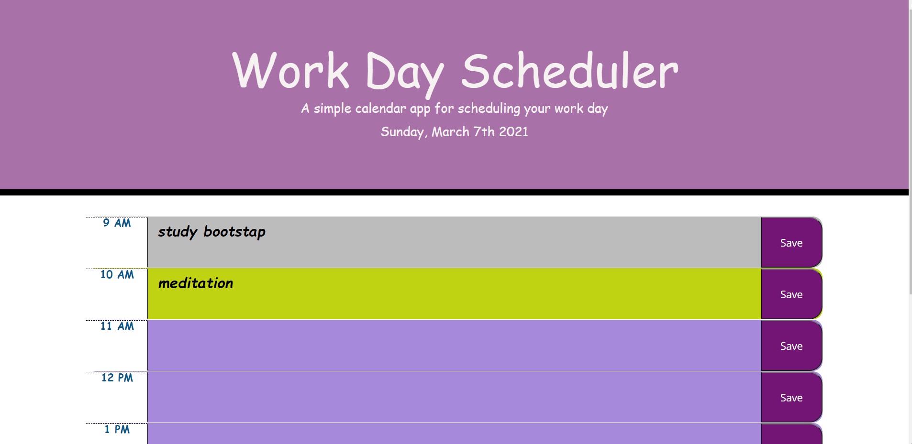

# work-Planner

# Description
 
  These is a daily work scheduler(planner) which includes the basic information required to complete the weekely challange.
  And below is the list of items I used upon the completion of the work palnner.

  I have learned a lot from these code base workplanner, it visualized my understanding of using bootstaps, moments and jquery libraries on the top of the base Javascript ,HTML and CSS.

  Here is a link to deploy my application:

   * Repo: https://github.com/senait77/work-Planner
   * Deploy: https://senait77.github.io/work-Planner/

## Table of contents

* [Installation](#installation)
* [Usage](#usage)
* [Credits](#credits)
* [License](#license)
* [General info](#genral-info)
* [Technologies](#technologies)
* [Project status](#project-status)
* [Contact](#contact)

## Installation
To run these project on the development enviroment:
* * In these project since it is odd number we are NOT stating from scrach, in thse case we have stating code base of HTML and CSS .In these case:-
* open " Git Bash"
* type " git init"(these will create a local repository in you computer and only you can acsess it, so you need to to push it to Git so that it is live on the web)
* Go to your gitHub page and create a new repository that includes a readme file and copy the URL for the ssh keys
* back to your git Bash and type
* * git remote add origin "copy the URL here"
* * git remote -v
* * IMPORTANT: You need to sync up with the remote GitHub repo first to get the README.md
* * git pull origin main
* Then push your first commits using :-
* * git add -A
    git commit -m "initial files"
    git push origin main
* * If you are starting your project from scrach then use these
* open " Git bash"
* "pwd" (print working directory simply tells you in which directory you are)
* use "code ."  to open it in your text editor, in these case VS code.
* Go to your GitHub.com 
* creat a new repository, where you can push your work remotly
* clone it with your local computer
* set your branch to main
* use " git add . " to add your work
* use " git commit -m "" " to commit chages you have made and finnally
* use "git push origin main" to push it to your remote repository
* * Now my project is locally saved in my computer and remotely saved on my GitHub.

## Usage 
Screen shot 
* 

## Credits
My web page is based and inspired by;
 * https://getbootstrap.com/
 * https://jqueryui.com/
 * https://momentjs.com/
 * The course module

 ## License
* [https://choosealicense.com/licenses/agpl-3.0/](https://choosealicense.com/licenses/agpl-3.0/)

## General info

* These daily work scheduler is based on the daily work hours where you are able to:-
* * see the curent date and time .
* * enter your schedual on the specific time range and save it in your local storage 
* * see color difference based on the current time wheather it is past, present or future.
## Technologies
On the top of  HTML, CSS and JavaScript, these web-page is created with:
* BootStap
* Jquery
* moments.js

## Project status
These project is still in developing mood, as it will be updated to a more detailed code with lots of illustrations.

## Contact
 * Created by Senait T Gerezgiher 
 * Email: senutekie77@gmail.com - Feel free to reach me and I am ready to assist.
